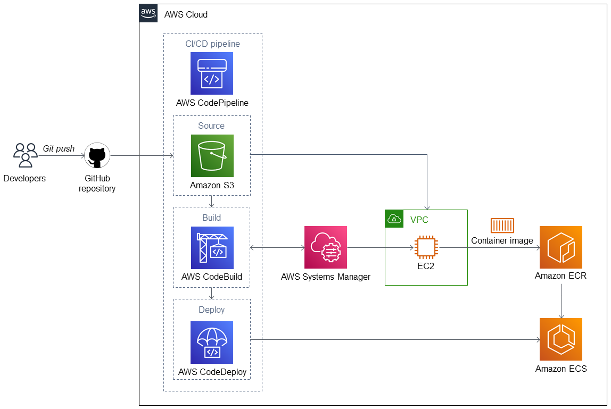

:xrefstyle: short

Deploying this Quick Start builds the following {partner-product-short-name} environment in the AWS Cloud.

[#architecture1]
.Quick Start architecture for {partner-product-short-name} on AWS

As shown in <<architecture1>>, the Quick Start sets up the following:

* AWS CodePipeline to create a pipeline with source, build, and deploy stages. CodePipeline polls the configured GitHub repository branch and starts the pipeline in response to a commit. CodePipeline retrieves the code from GitHub and stores it on Amazon Simple Storage Service (Amazon S3).
* AWS CodeBuild to manage the building of an updated Docker image of the application on a container. CodeBuild connects to AWS Systems Manager, which automates the following build functions:
** Provision of a temporary Amazon EC2 instance in the default virtual private cloud (VPC).
** Retrieval of code from Amazon S3.
** Building of a new Docker container image. 
** Publication of the new container image to Amazon Elastic Container Registry (Amazon ECR).
* Amazon ECR to host Docker container images.
* AWS CodeDeploy to create a new task definition that points to the newly-built Docker container image and updates Amazon Elastic Container Service (Amazon ECS) to use the new task definition.
* Amazon ECS to fetch the new Docker container from Amazon ECR and restart the service to deploy the application.

//[.small]#* The template that deploys the Quick Start into an existing VPC skips the components marked by asterisks and prompts you for your existing VPC configuration.#
