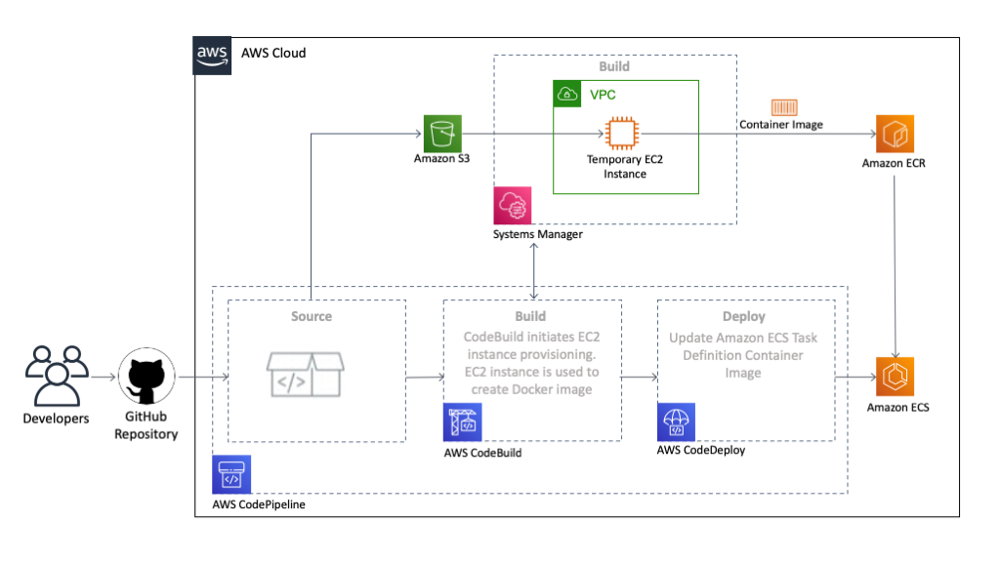

:xrefstyle: short

Deploying this Quick Start builds the following {partner-product-short-name} environment in the AWS Cloud.

[#architecture1]
.Quick Start architecture for {partner-product-short-name} on AWS

As shown in <<architecture1>>, the Quick Start sets up the following:

* An AWS CodePipeline with source, build, and deploy stages.
* An S3 bucket for holding artifacts.
* A temporary Amazon EC2 instance within the default VPC.
* A Systems Manager automation document used to launch the the temporary Amazon EC2 instance and execute the Docker build on the instance.
* An Amazon Elastic Container Registry (Amazon ECR) to hold the MSBuild container image.

//[.small]#* The template that deploys the Quick Start into an existing VPC skips the components marked by asterisks and prompts you for your existing VPC configuration.#
